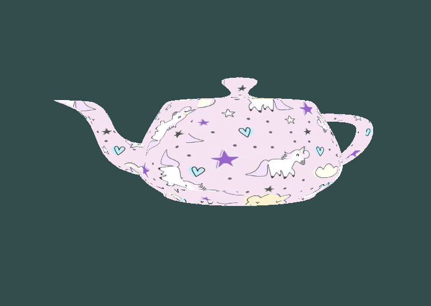
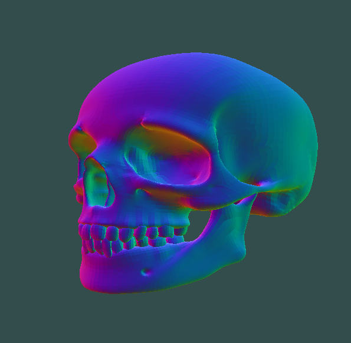

# Scop
Mini-projet d’Infographie de 42 qui sert d'introduction a OpenGL.

## Objectif
Realiser un programme qui affiche un objet 3D, tel que décrit dans un fichier au format `.obj`. Cet objet doit pouvoir tourner autour de son axe central et utiliser des niveaux de gris ou une texture sur ses faces.

## Utilisation
Ce programe se lance via la commande:

```sh
$ ./scop [.obj file]
```

If no `.obj` file is supplied, the program will use a built-in thetraedron model.

Once the program is launched, the following keyboard shortcuts are available :
  - W, A, S, D: Move the object
  - Q, E:       Rotate the object on Z axis
  - R, F:       Rotate the object on X axis
  - [, ]:       Change display mode (Faces, Lines, Points)
  - {, }:       Change color mode (Color, Unicorn, Normals, Monochrome)
  - -, =:       Change the distance of the camera from the object
  - SPACE:      Stop the time
  - ESC:        Quit

### Some screenshots




